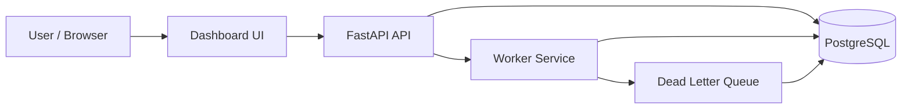

# Architecture Overview

## System Components

- Client / Browser
  - Serves the dashboard UI and submits REST API requests.
- FastAPI Application
  - Exposes authentication, queue, job, worker, and dashboard endpoints.
  - Uses Pydantic schemas for validation.
- SQLAlchemy ORM + PostgreSQL
  - Stores users, organizations, projects, queues, jobs, executions, logs, workers, heartbeats, and DLQ entries.
- Worker Service
  - Polls eligible jobs, claims them atomically, executes them, updates status, and writes execution logs.

## Runtime Flow

1. A user authenticates through the FastAPI API.
2. The API creates or queries organizations, projects, queues, and jobs.
3. The worker service claims pending jobs from the database.
4. The worker updates job status, writes execution logs, and routes failures to the dead-letter queue when retries are exhausted.
5. The dashboard reads job and worker state from the API for monitoring.

## High-Level Diagram

