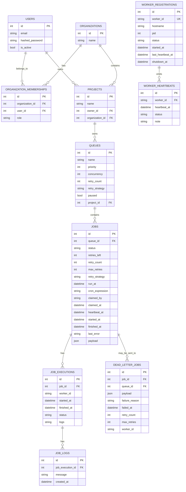

# ER Diagram

```mermaid
erDiagram
    USERS {
        int id PK
        string email
        string hashed_password
        bool is_active
    }

    ORGANIZATIONS {
        int id PK
        string name
    }

    ORGANIZATION_MEMBERSHIPS {
        int id PK
        int organization_id FK
        int user_id FK
        string role
    }

    PROJECTS {
        int id PK
        string name
        int owner_id FK
        int organization_id FK
    }

    QUEUES {
        int id PK
        string name
        int priority
        int concurrency
        int retry_count
        string retry_strategy
        bool paused
        int project_id FK
    }

    JOBS {
        int id PK
        int queue_id FK
        string status
        int retries_left
        int retry_count
        int max_retries
        string retry_strategy
        datetime run_at
        string cron_expression
        string claimed_by
        datetime claimed_at
        datetime heartbeat_at
        datetime started_at
        datetime finished_at
        string last_error
        json payload
    }

    JOB_EXECUTIONS {
        int id PK
        int job_id FK
        string worker_id
        datetime started_at
        datetime finished_at
        string status
        string logs
    }

    JOB_LOGS {
        int id PK
        int job_execution_id FK
        string message
        datetime created_at
    }

    WORKER_REGISTRATIONS {
        int id PK
        string worker_id UK
        string hostname
        int pid
        string status
        datetime started_at
        datetime last_heartbeat_at
        datetime shutdown_at
    }

    WORKER_HEARTBEATS {
        int id PK
        string worker_id FK
        datetime heartbeat_at
        string status
        string note
    }

    DEAD_LETTER_JOBS {
        int id PK
        int job_id FK
        int queue_id FK
        json payload
        string failure_reason
        datetime failed_at
        int retry_count
        int max_retries
        string worker_id
    }

    USERS ||--o{ ORGANIZATION_MEMBERSHIPS : belongs_to
    ORGANIZATIONS ||--o{ ORGANIZATION_MEMBERSHIPS : has
    USERS ||--o{ PROJECTS : owns
    ORGANIZATIONS ||--o{ PROJECTS : contains
    PROJECTS ||--o{ QUEUES : owns
    QUEUES ||--o{ JOBS : contains
    JOBS ||--o{ JOB_EXECUTIONS : has
    JOB_EXECUTIONS ||--o{ JOB_LOGS : has
    WORKER_REGISTRATIONS ||--o{ WORKER_HEARTBEATS : emits
    JOBS ||--o{ DEAD_LETTER_JOBS : may_be_sent_to
```
